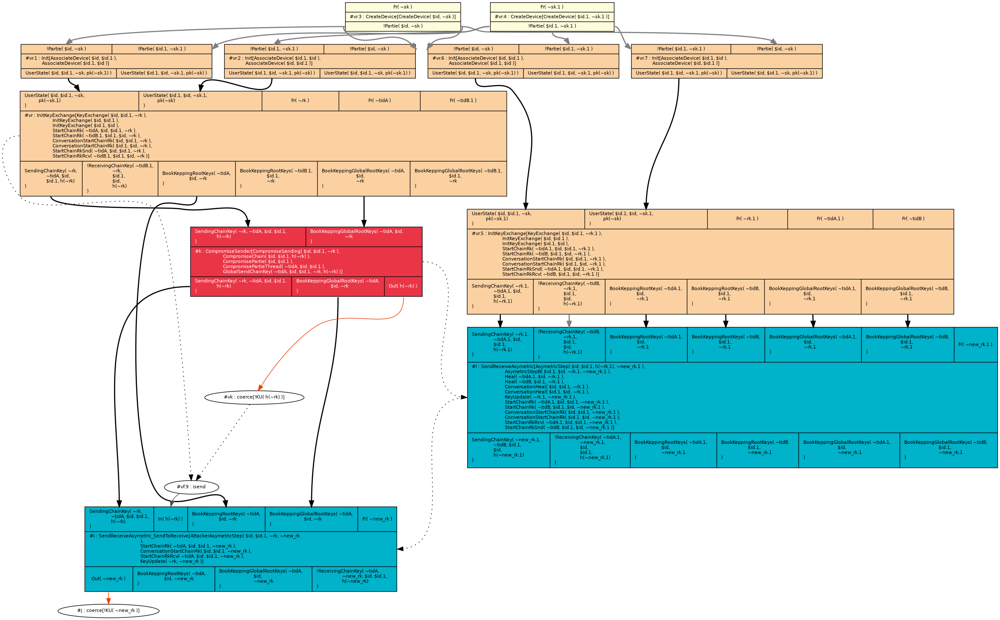

This repository contains a formal analysis of [Sesame](https://signal.org/docs/specifications/sesame/), Signal's session management and an abstracted version of the [Double Ratchet](https://signal.org/docs/specifications/doubleratchet/), Signal's messaging protocol.

## Table of Contents
1. [Double Ratchet](#double-ratchet)
2. [Sesame PCS Attack](#sesame-pcs-attack)
3. [Sesame with Sequential Session](#sesame-with-sequential-session)
4. [Sesame with Clone Detection](#sesame-with-clone-detection)

----------------------

### Double Ratchet

The model file [DoubleRatchet.spthy](DoubleRatchet.spthy) contains the following parts:

* Definitions of function symbols needed for the analysis, such as KDF.
* Restrictions (from line 77) to model some behaviours, such as registering one device per user, not allowing sessions with self, restricting only one active session, etc.
* User registration and initialization of the communication (from line 135).
* The rules for Asymmetric Ratchet (from line 192) between two honest parties, and between the attacker and one of the honest partner. This models the root key evolution and the healing phase for the honest parties.
* The rules for Symmetric Ratchet (from line 289), include the encryption key update, sending the message and receiving and skipping the message. 
* The rules that model the Attacker Compromise (from line 340).

The rest of the file contains all the proved lemmas: sanity traces, structural helper lemmas, **Forward Secrecy** (line 568), helper lemmas for PCS, **Post-Compromise Security** (line 3015), and Post-Compromise Security over all the sessions of the conversation (line 5233). (Note that in this case both properties are  essentially the same since the Double Ratchet has only one session.)

To *run* the file, write in the shell the following command:

`tamarin-prover --prove DoubleRatchet.spthy`

### Sesame PCS Attack

The model file [Sesame_PCSAttack.spthy](Sesame_PCSAttack.spthy) contains the stored proof of the attack on PCS.
To enable Sesame's multiple session, we modified the DR model described above by removing the single restriction with partner restriction, *SingleSessionWithSmbd*.

The following trace shows the attacker being able to perform an asymmetric steps (i.e. start a new session), after the two honest parties have already completed theirs.

To *run* the file, write in the shell the following command:

`tamarin-prover Sesame_PCSAttack.spthy`

### Sesame with Sequential Session

The model file [Sesame_Solution_RestoredPCS.spthy](Sesame_Solution_RestoredPCS.spthy) contains the modified version of Sesame to restore PCS.
To allow only for Sequential Sessions, old session need to expire upon session update. We add two restriction (from line 127) to model the mechanism.

The rest of the file remains the same with now the main lemmas,  **Forward Secrecy** (line 576), Post-Compromise Security per single session (line 4716), and the main lemmas **Post-Compromise Security** for the entire conversation (line 5249).   

To *run* the file, write in the shell the following command:

`tamarin-prover --prove Sesame_Solution_RestoredPCS.spthy`

### Sesame with Clone Detection

The model file [Sesame_CloneDetection.spthy](Sesame_CloneDetection.spthy) contains the modified version of Sesame with Sequential Sessions and A warning message to detect clones.
To model the receiver sending a warning message to the sender, we add two new rules (from line 348) to distinguish between receiving from an old and new session. The rule for the sender detecting that indeed the warned key was not their own is in line 427. One restriction (from line 131) models the honest party comparing the keys it has generated.

The rest of the file remains the same with now the main lemma **Clone Detection Soundness** (line 4033).   

To *run* the file, write in the shell the following command:

`tamarin-prover --prove Sesame_CloneDetection.spthy`

------------------------------

The file [oracle.py](oracle.spthy) is a file used to guide some of the proofs in Tamarin.
